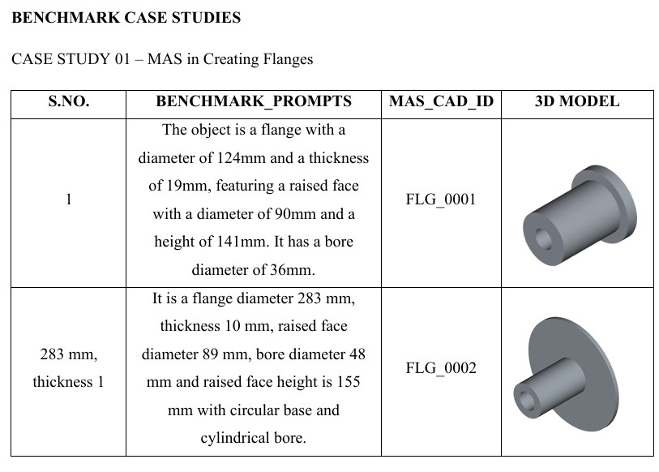

# MAS-CAD: Multi-Agent System for CAD Design

MAS-CAD is an advanced Multi-Agent System (MAS) designed to transform natural language queries into precise, functional 3D CAD models using the **CadQuery** framework. It leverages a collaborative agent architecture to plan, execute, and refine CAD code autonomously.

## 🚀 Key Features
- **Multi-Agent Architecture**: Distributes tasks between a specialized **Planner Agent** and an **Executor Agent**.
- **Natural Language to CAD**: Converts human-readable descriptions into executable Python code.
- **Autonomous Debugging**: The Executor Agent includes self-correction logic to iterative fix code errors.
- **CadQuery Integration**: Generates geometric models based on parametric, script-based CAD.
- **Comprehensive Evaluation**: Includes built-in metrics (like IoU) and recursive evaluation notebooks for performance benchmarking.

## 🏗️ Architecture

1.  **Planner Agent**: Analyzes the user's natural language query and generates a structured decomposition (JSON) of the part's parameters, features, and assembly logic.
2.  **Executor Agent**: Consumes the plan to write robust CadQuery Python code. It handles environment setup, error detection, and iterative debugging to ensure the final script executes successfully.

## 📁 Project Structure
- `main.py`: The entry point for running the MAS-CAD pipeline.
- `Agents/`: Contains implementation for `planner_agent.py` and `executor_agent.py`.
- `INPUT_PAIRS/`: Dataset for benchmark prompt-part pairs.
- `OUTPUT/`: Generated results, including JSON plans and final CadQuery scripts.
- `JSON_EVALUATION_METRICS/`: Excel benchmarks for model performance across various part categories (Gear, Shaft, Nut, etc.).
- `IOU_METRIC.py`: Utility for calculating Intersection over Union (IoU) of generated geometries.
- `Benchmark_Dataset/`: Reference files for evaluation.

## 🛠️ Getting Started

### Prerequisites
- Python 3.9+
- Conda (recommended for CadQuery environment management)

### Installation
1.  Clone the repository:
    ```bash
    git clone <repository-url>
    cd MAS_CAD
    ```
2.  Install dependencies:
    ```bash
    pip install -r requirements.txt
    ```
3.  Set up environment variables in a `.env` file (OpenAI/Anthropic API keys).

### Usage
Run the main script and enter your CAD query when prompted:
```bash
python main.py
```

## 📊 Evaluation
The project includes several Jupyter notebooks (e.g., `FLANGE_JSON_EVALUATION_METRIC.ipynb`) to evaluate the accuracy of the agents against benchmark datasets. Metrics are focused on geometric precision and JSON schema adherence.

### Benchmark Case Studies


## 📜 License
[Insert License Information]
